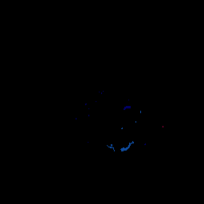
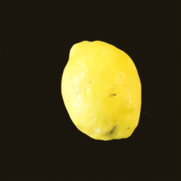
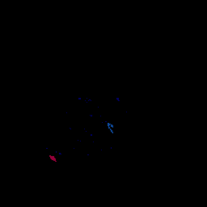
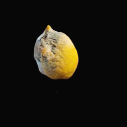
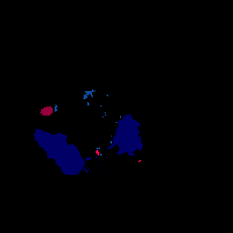
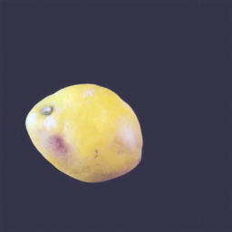
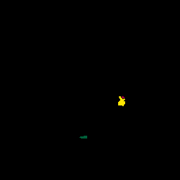
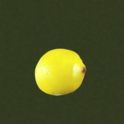

# Improved Semantic Diffusion Model (ISDM)

A method to enhance existing supervised (and scarce) semantic segmentation datasets for defect/anomaly detection with synthetic data from Semantic Diffusion Models.

&nbsp;

  

&nbsp;

## Paper
This project was part of my master thesis on [Improving Semantic Segmentation Models through Synthetic Data Generation via Diffusion Models](./assets/Master_Thesis.pdf).
I defended my master thesis at the Free University of Bolzano on 29/09/2023 with [this presentation](./assets/Master_Thesis.pptx).  

## Abstract
Industrial datasets for semantic segmentation are typically scarce because of the time-consuming annotation procedure. However, modern deep learning model architectures for this task require a large amount of data and therefore perform below their potential capabilities when trained on small datasets. This makes semantic segmentation on industrial datasets a suitable candidate for the application of current advances with generative models. Particularly, recent Diffusion Models (DMs), which are mainly known for applications in the field of art, can be exploited to enhance existing datasets with synthetic data. In principle, DMs can be used to sample arbitrary amounts of data and thus to adapt the sparse existing datasets such that the models for semantic segmentation can be better trained on them. In the case of semantic segmentation, however, it is not enough just to generate the images, the images must also matchwith corresponding labels on a pixel level. In this thesis, two main approaches, namely semantic imagesynthesis and paired image-mask synthesis, are discussed in detail. Furthermore, two implementations for these approaches are proposed that allow training DMs on small-scale industrial semantic segmentation datasets and generating corresponding synthetic datasets. These implementations are referred to as “All-Latent” and “Improved Semantic Diffusion Model” (ISDM), named after the types of DMs on which they are built. Extensive experiments with three different semantic segmentation architectures are conducted to evaluate the impact of the synthetic datasets generated by All-Latent and ISDM in terms of the mean intersection-over-union (mIoU) score. They show that for both methods the generated data can contribute to improved performance of the downstream semantic segmentation models without modifying the models themselves. Especially when the models are trained on a mix of real and synthetic data, performance improvements with respect to the baseline model, which is trained on real data only, can be achieved in several experiments. This could be demonstrated for binary as well as for multi-class segmentation. For some experiments, it was even possible to achieve improvements when training the models only with synthetic data.

## Acknowledgement
This repository is strongly based on the work of [semantic-diffusion-model](https://github.com/WeilunWang/semantic-diffusion-model) which in turn builds on [guided-diffusion](https://github.com/openai/guided-diffusion). The evaluation is taken from [conditional-polyp-diffusion](https://github.com/simulamet-host/conditional-polyp-diffusion). The dataset on which the approach was predominantly tested is the [Lemons quality control dataset](https://github.com/softwaremill/lemon-dataset).

## Evaluation
For information about the evaluation strategy and the obtained results please refer to my [master thesis](./assets/Master_Thesis.pdf).

## Contributions
This implementation adapts the Semantic Diffusion Model approach for semantic image synthesis using scarce real datasets. There are two major changes compared to the original implementation:

1. The tracking of training epochs and an improved model checkpointing based on the training loss of an epoch. (While it would be more common to use a separate validation set and thus the validation loss as a checkpointing criterion, this proved to be suboptimal for the small initial datasets that were tested.) This change also involves a maximal number of epochs after which training is aborted automatically (before it had to be stopped manually) and the avoidance to save (possible unusable and redundant) checkpoints every 10000 optimiser steps, both of which is beneficial for disk space.

2. The reduction of necessary sampling steps. Instead of using 1000 diffusion steps for sampling and training, it was found that the diffusion steps during sampling can be reduced to 300 (or less) if the "rescale_timesteps" parameter is set to true.

Instead of specifying the necessary scripts and parameters on the command line, all the possible actions (train, finetune, sample) are wrapped into the [main.py](./main.py) script and controlled via configuration files in JSON format. Find the installation and execution instructions below.

## Dependency Installation

Conda is used for dependency and virtual environment management. The code was tested on Linux using a single Ubuntu machine as well as a HPC cluster managed by slurm. Below you find installation instructions for both machines the code was tested on, but be aware that from my past experience I know that setting up running conda environments from environment.yml files rarely works without problems.

### Ubuntu
> conda env create -f ubuntu_environment.yml

#### System Description
OS: Ubuntu 23.04

CPU: AMD Ryzen 7 5700X 8-Core Processor

RAM: 62 GB

GPU: NVIDIA GeForce RTX 3060 12 GB

### HPC Cluster
> conda env create -f hpc_environment.yml

#### System Description
University-owned HPC cluster with several GPU nodes.

<!-- ### Windows
OS: Windows 10 Enterprise LTSC

CPU: Intel Core i9-10900X

RAM: 64 GB

GPU: NVIDIA GeForce RTX 3090 24 GB -->

## Execution

### Required Data Format
The SDMs need to be trained on real semantic segmentation datasets. So, it is required to have images and corresponding pixel-level labels (semantic masks). Such datasets come in different formats and the original code would also support for some of these, but for my master thesis I used a very simple format of saving both images and semantic masks as picture files. Images can be in PNG and JPG format and masks are required to be PNGs. They need to be saved in separate folders named "images" and "masks" and corresponding files need to share a filename. Furthermore, it is required to provide train and test datasets. The test dataset is only used during evaluation to check if the synthetic data actually helps to improve semantic segmentation models. Therefore, the final required folder structure should look like the following:

├── dataset_name
│   ├── test
│   │   ├── images
│   │   │   ├── **/*.jpg
│   │   │   ├── **/*.png
│   │   ├── masks
│   │   │   ├── **/*.png
│   ├── train
│   │   ├── images
│   │   │   ├── **/*.jpg
│   │   │   ├── **/*.png
│   │   ├── masks
│   │   │   ├── **/*.png

If you follow this structure then you can just set the configuration parameters `data_dir` to <dataset_name> and `dataset_mode` to "lemon-binary" or "lemon-multi-class" depending on if your dataset is a binary or multi-class segmentation dataset.

### Actions and Config Files
ISDM supports to perform three different actions ("train", "finetune" and "sample") all of which require slightly different configuration files.

1. Train: This action trains a SDM on the specified dataset. It is launched using the command:
> python main.py train -c configs/config_train.json

One will need to change the default [train configuration](./configs/config_train.json) according to his dataset. The parameters that (may) need to be changed are:
* data_dir: As explained above in section "Required Data Format"
* dataset_mode: As explained above in section "Required Data Format"
* batch_size: use smaller values to prevent OOM exceptions
* num_channels: use smaller values to prevent OOM exceptions
* image_size: adjust for your usecase
* num_classes: set it to 2 if dataset_mode is "lemon-binary"
* resume_checkpoint: this is only used to resume a previous model training, don't specify this parameter for fresh training processes

2. Finetune: Finetuning an SDM consists of randomly replacing the real semantic mask with the so-called null/empty label (semantic mask consisting only of 0 values). There are two additional parameters in the default [finetune configuration](./configs/config_finetune.json) compared to the default train configuration:
* drop_rate: probability to "drop" the real semantic mask
* resume_checkpoint: path to the model that should be finetuned (use the .pt file called "model" and not "ema")

3. Sample: Sampling is the process of generating synthetic datasets with SDMs. During sampling semantic masks from the real train set are used to condition the synthesis of corresponding images. As for the "train" and "finetune" actions, to "sample" one will need to change the default [sample configuration](./configs/config_sample.json) according to his needs. The parameters that are of particular importance for sampling are:
* diffusion_steps and rescale_timesteps: for the original SDM implementation the diffusion steps for sampling would correspond to the ones used during the traininig process (usually 1000), but if "rescale_timesteps" is true, I found that using as few as 300 diffusion steps is sufficient.
* num_samples: number of images to generate
* model_path: SDM to use for sampling (use the .pt file called "ema" and not "model")
* s: Guidance scale that controls the influence of the semantic mask for conditioning the diffusion process. (s=1.5 showed to work fine for the datasets I tested)
* balance_args: This optional parameter is itself a dictionary containing different parameters. If it is specified, it is tried to sample in a way such that the class pixel count is balanced accross the generated (and real) images. The (sub-)parameters that can be set within this dictionary are:
  * max_class_dif: maximum relative difference between the classes. Default 0.1.
  * based_on_generated_data_only: If balancing should consider only the generated data, or the existing real data too. Default false. Other values than default are not implemented yet.
  * based_on_pixel_count: Default true. Other values than default are not implemented yet.
  * ejection_classes: Default [0]. Other values than default are not implemented yet.
  * use_mask_augmentation: Default false. Other values than default are not implemented yet.

The outputs of the sampling process are saved as subfolders of the [Results](./RESULTS/) folder. Each output folder itself contains four subfolders:
* labels: contains the real semantic masks that are used for conditioning the sampling process. These garyscale picture files might appear completely black, because class values start from 0 (black) onwards and therefore low class values are not easy to distinguish from pure black.
* images: contains the real images the correspond to the labels
* colored_labels: contains the same information as labels, but color-coded such that the different classes are easier to recognise.
* samples: The images generated by the SDM and corresponding to the label files with the same name.

## Showcase

Semantic Mask             |  Corresponding Sample
:------------------------:|:-------------------------:
  |  
  |  
  |  
  |  
  |  
  |  

## License
TODO

## Citation
If you use this project for your work, please cite ... TODO
